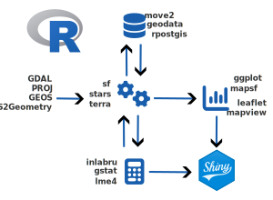
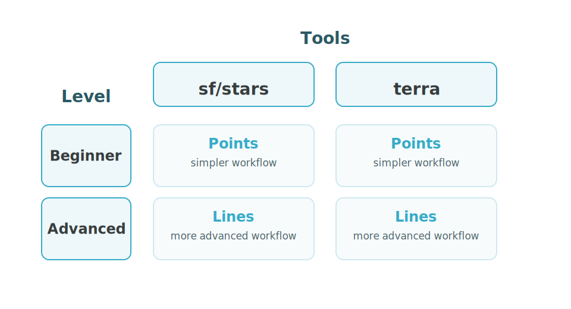
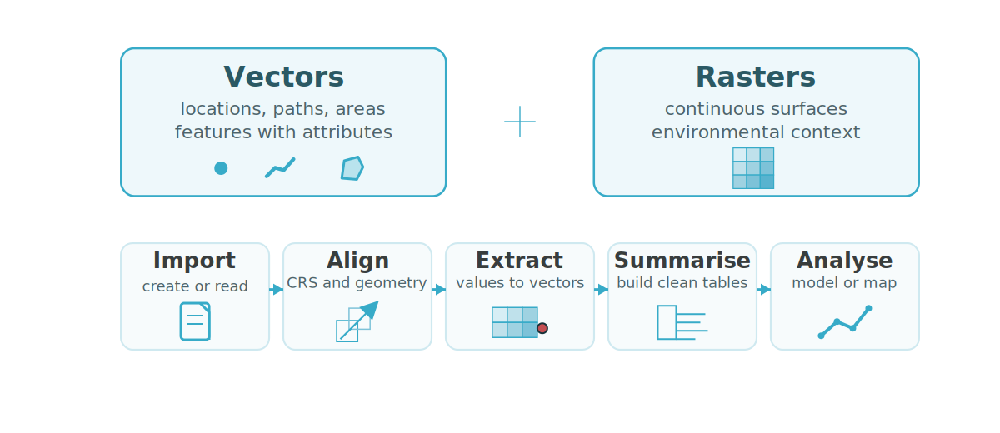

# Bienvenue

```{=html}
<script>
document.addEventListener('DOMContentLoaded', function() {
  var logo = document.querySelector('.slide-logo');
  if (logo) {
    var link = document.createElement('a');
    link.href = 'https://www.insileco.io';
    link.target = '_blank';
    logo.parentNode.insertBefore(link, logo);
    link.appendChild(logo);
  }
});
</script>
```

<!-- Configuration des données et des bibliothèques -->
```{r}
#| message: false
#| warning: false
#| echo: false
source("setup_slide_data.R", local = knitr::knit_global())
```


<!-- Tour de table + diapo insileco? -->
<!-- Quelles sont vos attentes? -->


# Objectifs

## A quoi s'attendre

:::: {.columns}
::: {.column width="50%"}
::: {.callout-note}
## Ce que cet atelier est

- une introduction pratique aux flux de travail spatiaux dans R
- un atelier sur l'utilisation opérationnelle de R comme SIG
- axé sur les manipulations courantes que vous réutiliserez dans vos projets
:::
:::
::: {.column width="50%"}
::: {.callout-warning}
## Ce que cet atelier n'est pas

- pas un cours complet de géodésie, cartographie ou télédétection
- pas un survol de chaque paquet ou méthode spatiale
- pas un cours de géocalcul axé sur la théorie
:::
:::
::::


## Ressources

- [Visualisation et analyse de données spatiales sous R (FR)](https://sci1031.github.io/sci1031/)
- [Geocomputation with R](https://r.geocompx.org/)
- [Spatial Data Science](https://r-spatial.org/book/)

## Objectif de l'atelier

<br>

::: {.fz125}

À la fin de l'atelier, les participants devraient être capables d'utiliser R comme SIG, de travailler de manière opérationnelle avec les manipulations spatiales courantes, et d'avoir les bons outils en main pour continuer à apprendre.

:::


## Notre focus

- importer des données spatiales
- inspecter la géométrie et le CRS
- transformer et filtrer les données
- mesurer des distances, surfaces et longueurs
- combiner des couches par jointures et superpositions
- extraire des valeurs raster vers des entités vectorielles
- construire des résumés, analyses et cartes

## Structure de l'atelier

:::: {.columns}
::: {.column width="50%"}
::: {.callout-note}
## Matériel

- diapositives courtes axées sur les concepts
- exemples en direct dans R
- scripts et ressources réutilisables pour révision ultérieure
:::
:::
::: {.column width="50%"}
::: {.callout-tip}
## Exercices

- exercices pratiques ciblés
- conçus spécifiquement pour les participants de l'atelier
- basés sur les données partagées avant l'événement
:::
:::
::::

::: {.callout icon=false}
L'atelier alterne entre du matériel pédagogique concis et des exercices appliqués, afin que les participants puissent passer directement des concepts à la pratique.
:::

# R comme SIG

<!-- Discuter pourquoi il est pertinent d'utiliser R comme SIG -->

## Construire des pipelines reproductibles



::: {.notes}
Pourrait être python etc...
Similaire à QGIS pour les bibliothèques C
:::


## Données spatiales

<table class="spatial-objects-table">
  <thead>
    <tr>
      <th>Type d'objet</th>
      <th>Description</th>
      <th><code>sf</code></th>
      <th><code>stars</code></th>
      <th><code>terra</code></th>
    </tr>
  </thead>
  <tbody>
    <tr class="family-row">
      <td>Vecteur</td>
      <td class="family-note"><em>Où sont les entités?</em></td>
      <td></td>
      <td></td>
      <td></td>
    </tr>
    <tr>
      <td> Points</td>
      <td>Emplacements discrets avec coordonnées et attributs.</td>
      <td><span class="pkg-check">&#10003;</span></td>
      <td></td>
      <td><span class="pkg-check">&#10003;</span></td>
    </tr>
    <tr>
      <td> Lignes</td>
      <td>Entités linéaires comme les routes, rivières ou tracés.</td>
      <td><span class="pkg-check">&#10003;</span></td>
      <td></td>
      <td><span class="pkg-check">&#10003;</span></td>
    </tr>
    <tr>
      <td> Polygones</td>
      <td>Surfaces comme les lacs, zones d'étude ou limites administratives.</td>
      <td><span class="pkg-check">&#10003;</span></td>
      <td></td>
      <td><span class="pkg-check">&#10003;</span></td>
    </tr>
    <tr class="family-row">
      <td>Raster</td>
      <td class="family-note"><em>Quelle est la valeur à travers l'espace?</em></td>
      <td></td>
      <td></td>
      <td></td>
    </tr>
    <tr>
      <td> Rasters</td>
      <td>Surfaces quadrillées avec des valeurs stockées dans des cellules.</td>
      <td></td>
      <td><span class="pkg-check">&#10003;</span></td>
      <td><span class="pkg-check">&#10003;</span></td>
    </tr>
  </tbody>
</table>

## Principaux paquets spatiaux R

***Nouvel écosystème***

:::: {.columns}
::: {.column width="33%"}

::: {.callout-tip icon=false}
### `sf` <span class="pkg-link-wrap"><a href="https://r-spatial.github.io/sf/" target="_blank" rel="noopener noreferrer" class="pkg-link" aria-label="sf documentation">&#127760;</a></span>

- standard [simple features](https://www.iso.org/standard/40114.html)
- données vectorielles
- compatible tidyverse
:::
:::
::: {.column width="33%"}
::: {.callout-tip icon=false}
### `stars` <span class="pkg-link-wrap"><a href="https://r-spatial.github.io/stars/" target="_blank" rel="noopener noreferrer" class="pkg-link" aria-label="stars documentation">&#127760;</a></span>

- tableaux spatio-temporels
- rasters et datacubes
- compagnon solide de `sf`
:::
:::
::: {.column width="33%"}
::: {.callout-tip icon=false}
### `terra` <span class="pkg-link-wrap"><a href="https://rspatial.github.io/terra/" target="_blank" rel="noopener noreferrer" class="pkg-link" aria-label="terra documentation">&#127760;</a></span>

- support vecteur et raster
- outils raster puissants
- flux de travail SIG complet
:::
:::
::::

***Ancien écosystème***

:::: {.columns}
::: {.column width="33%"}

::: {.callout-important icon=false}
### `sp` <span class="pkg-link-wrap"><a href="https://cran.r-project.org/web/packages/sp/" target="_blank" rel="noopener noreferrer" class="pkg-link" aria-label="sp documentation">&#127760;</a></span>

- données vectorielles
:::
:::
::: {.column width="33%"}
::: {.callout-important icon=false}
### `raster` <span class="pkg-link-wrap"><a href="https://cran.r-project.org/web/packages/raster/" target="_blank" rel="noopener noreferrer" class="pkg-link" aria-label="raster documentation">&#127760;</a></span>

- rasters
:::
:::
::: {.column width="33%"}
:::
::::

## Paquets accompagnateurs

***Manipulation de données et mesures***

:::: {.columns}
::: {.column width="33%"}
::: {.callout-tip icon=false}
### `tidyverse` <span class="pkg-link-wrap"><a href="https://www.tidyverse.org/" target="_blank" rel="noopener noreferrer" class="pkg-link" aria-label="tidyverse website">&#127760;</a></span>

- flux de travail tabulaires autour des objets spatiaux
- filtrage, jointure, regroupement, résumé
:::
:::
::: {.column width="33%"}
::: {.callout-tip icon=false}
### `tidyterra` <span class="pkg-link-wrap"><a href="https://dieghernan.github.io/tidyterra/" target="_blank" rel="noopener noreferrer" class="pkg-link" aria-label="tidyterra documentation">&#127760;</a></span>

- verbes tidy et fonctions de visualisation pour `terra`
- une extension utile, pas un remplacement de `terra`
:::
:::
::: {.column width="33%"}
::: {.callout-tip icon=false}
### `units` <span class="pkg-link-wrap"><a href="https://r-quantities.github.io/units/" target="_blank" rel="noopener noreferrer" class="pkg-link" aria-label="units documentation">&#127760;</a></span>

- longueurs, surfaces et distances explicites dans `sf`
- contraste avec `terra` => mesures numériques
:::
:::
::::

***Visualisation***

:::: {.columns}
::: {.column width="33%"}
::: {.callout-note icon=false}
### `ggplot2` <span class="pkg-link-wrap"><a href="https://ggplot2.tidyverse.org/" target="_blank" rel="noopener noreferrer" class="pkg-link" aria-label="ggplot2 website">&#127760;</a></span>

- graphiques statiques de qualité pour communication
- cartes en couches flexibles
:::
:::
::: {.column width="33%"}
::: {.callout-note icon=false}
### `mapview` <span class="pkg-link-wrap"><a href="https://r-spatial.github.io/mapview/" target="_blank" rel="noopener noreferrer" class="pkg-link" aria-label="mapview documentation">&#127760;</a></span>

- exploration interactive rapide
- vérifications visuelles rapides des couches spatiales
:::
:::
::: {.column width="33%"}
::: {.callout-note icon=false}
### `tmap` <span class="pkg-link-wrap"><a href="https://r-tmap.github.io/tmap/" target="_blank" rel="noopener noreferrer" class="pkg-link" aria-label="tmap website">&#127760;</a></span>

- flux de travail de cartographie
- cartes statiques et interactives
:::
:::
::::

::: {.callout-warning}
#### Ce sont des exemples de paquets accompagnateurs particulièrement pertinents. L'écosystème spatial de R est vaste et actif, et ne se limite pas aux paquets présentés ici.
:::

## Une note sur les IDE

*Que sont les IDE? Environnements de développement intégrés*

:::: {.columns}
::: {.column width="33%"}
::: {.callout-tip icon=false}
### `RStudio` <span class="pkg-link-wrap"><a href="https://posit.co/products/open-source/rstudio/" target="_blank" rel="noopener noreferrer" class="pkg-link" aria-label="RStudio website">&#127760;</a></span>

- environnement par défaut de longue date pour R
- console, éditeur, graphiques, fichiers et paquets intégrés
- un bon point de départ pour la plupart des utilisateurs de R
:::
:::
::: {.column width="33%"}
::: {.callout-tip icon=false}
### `VS Code` <span class="pkg-link-wrap"><a href="https://code.visualstudio.com/" target="_blank" rel="noopener noreferrer" class="pkg-link" aria-label="VS Code website">&#127760;</a></span>

- éditeur généraliste avec support R via des extensions
- adapté aux flux de travail mixtes R, Python, Quarto, Git
- une bonne option pour les projets multilingues
:::
:::
::: {.column width="33%"}
::: {.callout-tip icon=false}
### `Positron` <span class="pkg-link-wrap"><a href="https://positron.posit.co/" target="_blank" rel="noopener noreferrer" class="pkg-link" aria-label="Positron website">&#127760;</a></span>

- nouvel IDE de science des données de Posit, similaire à VS Code
- combine scripts, notebooks et fonctionnalités IDE
- à suivre au fur et à mesure que l'écosystème évolue
:::
:::
::::

::: {.callout-warning}
### L'objectif de cet atelier n'est pas d'enseigner un IDE spécifique. Utilisez l'environnement qui vous permet de travailler confortablement avec des scripts, objets, graphiques et sorties spatiales.
:::

## Une note sur les pipes

::: {.callout-note}
### Que sont les pipes?

Les pipes transmettent la sortie d'une étape à la suivante, rendant les flux de travail à plusieurs étapes plus faciles à lire et à écrire. Nous les mentionnons explicitement car ils sont utilisés tout au long de l'atelier.
:::

<br>

:::: {.columns}

::: {.column width="50%"}

`magrittr` ***pipes :*** `%>%`

```R
CO2 %>%
  dplyr::filter(Type == "Quebec")
```
:::

::: {.column width="50%"}

***pipes natifs :*** `|>`

```R
CO2 |>
  dplyr::filter(Type == "Quebec")
```

:::

::::


::: {.footer}
[The tidy tools manifesto](https://tidyverse.tidyverse.org/articles/manifesto.html)
:::


## Une note sur le code

***Choisissez vos outils***

::: {.panel-tabset .code-tabs}
##### `sf/stars`

```{r}
#| eval: false
sf_object <- sf::function(...)
stars_object <- stars::function(...)
```

##### `terra`

```{r}
#| eval: false
terra_object <- terra::function(...)
```
:::

<br>

::: {.callout-note}
### Naviguer dans le code de la présentation
Les diapositives montrent souvent la même opération deux fois : une fois avec `sf/stars`, et une fois avec `terra`.

Vous n'avez pas besoin de suivre les deux versions en même temps. Utilisez les onglets pour rester dans l'écosystème que vous avez choisi pour l'atelier.
:::


## Une note sur les exercices

***Choisissez votre parcours***

{width=82% fig-align="center"}

::: {.callout-note}
### Faites les deux niveaux!
Les participants plus avancés peuvent compléter les deux parcours, car il y aura des flux de travail avancés disponibles avec les points et les lignes.
:::


# Données vectorielles dans R

***sf*** & ***terra***

## Lire des données vectorielles

::: {.panel-tabset .code-tabs}
##### `sf`

```{r}
#| message: false
#| warning: false
#| eval: false
aoi <- st_read("data/polygons.gpkg", layer = "study_area")
zones <- st_read("data/polygons.gpkg", layer = "zones")
aoi
zones
```

::: {.columns}
::: {.column width="65%"}
```{r}
#| message: false
#| warning: false
#| echo: false
head(aoi)
head(zones)
```
:::
::: {.column width="35%"}
```{r}
#| message: false
#| warning: false
#| echo: false
#| fig-width: 7
#| fig-height: 5.5
#| out-width: 100%
#|
par(mar = c(0, 0, 0, 0))
plot(
  st_geometry(aoi),
  col = "#f7fbfc",
  border = "#355c67",
  lwd = 2.5,
  axes = FALSE,
  main = ""
)
plot(
  st_geometry(zones),
  add = TRUE,
  col = c("#9ecae1aa", "#fdae6baa", "#a1d99baa", "#fdd0a2aa"),
  border = "#264653",
  lwd = 1.2
)
zone_centers <- st_coordinates(st_centroid(zones))
text(
  zone_centers[, 1],
  zone_centers[, 2],
  labels = zones$zone_id,
  cex = 0.9,
  font = 2,
  col = "#17323a"
)
```

:::
:::
<!-- fin colonnes -->


##### `terra`

```{r}
#| message: false
#| warning: false
#| eval: false
aoi <- vect("data/polygons.gpkg", layer = "study_area")
zones <- vect("data/polygons.gpkg", layer = "zones")
aoi
zones
```

::: {.columns}
::: {.column width="65%"}
```{r}
#| message: false
#| warning: false
#| echo: false
head(terra_aoi)
head(terra_zones)
```
:::
::: {.column width="35%"}
```{r}
#| message: false
#| warning: false
#| echo: false
#| fig-width: 7
#| fig-height: 5.5
#| out-width: 100%
par(mar = c(0, 0, 0, 0))
plot(
  terra_aoi,
  col = "#f7fbfc",
  border = "#355c67",
  lwd = 2.5,
  axes = FALSE,
  main = ""
)
plot(
  terra_zones,
  add = TRUE,
  col = c("#9ecae1aa", "#fdae6baa", "#a1d99baa", "#fdd0a2aa"),
  border = "#264653",
  lwd = 1.2
)
zone_centers <- terra::crds(terra::centroids(terra_zones))
text(
  zone_centers[, 1],
  zone_centers[, 2],
  labels = terra_zones$zone_id,
  cex = 0.9,
  font = 2,
  col = "#17323a"
)
```

:::
:::
<!-- fin colonnes -->
:::

## Créer des points à partir d'un tableau

::: {.panel-tabset .code-tabs}
##### `sf`

```{r}
#| message: false
#| warning: false
#| eval: false
stations <- read.csv("data/points.csv") |>
  st_as_sf(coords = c("lon", "lat"), crs = 4326, remove = FALSE)
```

::: {.columns}
::: {.column width="65%"}
```{r}
#| message: false
#| warning: false
#| echo: false
head(points_sf)
```
:::
::: {.column width="35%"}
<br>

```{r}
#| message: false
#| warning: false
#| echo: false
#| fig-width: 7
#| fig-height: 5.5
#| out-width: 100%
par(mar = c(0, 0, 0, 0))
plot(
  st_geometry(aoi),
  col = "#f7fbfc",
  border = "#355c67",
  lwd = 2,
  axes = FALSE,
  main = ""
)
plot(
  st_geometry(zones),
  add = TRUE,
  col = c("#9ecae144", "#fdae6b44", "#a1d99b44", "#fdd0a244"),
  border = "#264653",
  lwd = 1
)
plot(
  st_geometry(points_sf),
  add = TRUE,
  pch = 21,
  bg = "#c44e5288",
  col = "#7f1d1d",
  cex = 1.1
)
```

:::
:::
<!-- fin colonnes -->

##### `terra`

```{r}
#| message: false
#| warning: false
#| eval: false
stations <- read.csv("data/points.csv") |>
  vect(geom = c("lon", "lat"), crs = "EPSG:4326")
```

::: {.columns}
::: {.column width="65%"}
```{r}
#| message: false
#| warning: false
#| echo: false
head(terra_points)
```
:::
::: {.column width="35%"}
```{r}
#| message: false
#| warning: false
#| echo: false
#| fig-width: 7
#| fig-height: 5.5
#| out-width: 100%
par(mar = c(0, 0, 0, 0))
plot(
  terra_aoi,
  col = "#f7fbfc",
  border = "#355c67",
  lwd = 2,
  axes = FALSE,
  main = ""
)
plot(
  terra_zones,
  add = TRUE,
  col = c("#9ecae144", "#fdae6b44", "#a1d99b44", "#fdd0a244"),
  border = "#264653",
  lwd = 1
)
plot(
  terra_points,
  add = TRUE,
  pch = 21,
  bg = "#c44e5288",
  col = "#7f1d1d",
  cex = 1.1
)
```

:::
:::
<!-- fin colonnes -->
:::


## Inspecter les données vectorielles

::: {.panel-tabset .code-tabs}
##### `sf`

```{r}
#| message: false
#| warning: false
#| eval: false
st_geometry_type(zones)
st_crs(zones)$input
st_bbox(zones)
```
```{r}
#| message: false
#| warning: false
#| echo: false
#| results: markup
st_geometry_type(zones)
st_crs(zones)$input
st_bbox(zones)
```

##### `terra`

```{r}
#| message: false
#| warning: false
#| eval: false
geomtype(terra_zones)
crs(terra_zones, proj = TRUE)
ext(terra_zones)
```
```{r}
#| message: false
#| warning: false
#| echo: false
#| results: markup
geomtype(terra_zones)
crs(terra_zones, proj = TRUE)
ext(terra_zones)
```
:::

<br>

::: {.callout-note}
### Projections spatiales
L'information CRS vous indique comment les coordonnées sont référencées sur la Terre. Quand vous avez besoin d'inspecter ou d'identifier une projection, [epsg.io](https://epsg.io/) est un outil de recherche utile.
:::

## Transformer le CRS

::: {.panel-tabset .code-tabs}
##### `sf`

```{r}
#| message: false
#| warning: false
#| eval: false
zones_qc <- st_transform(zones, 32198)
points_qc <- st_transform(points_sf, 32198)
st_crs(points_qc)$input
st_bbox(points_qc)
```

::: {.columns}
::: {.column width="65%"}
```{r}
#| message: false
#| warning: false
#| echo: false
#| results: markup
st_crs(points_sf_qc)$input
st_bbox(points_sf_qc)
```
:::
::: {.column width="35%"}
```{r}
#| message: false
#| warning: false
#| echo: false
#| fig-width: 7
#| fig-height: 5.5
#| out-width: 100%
par(mar = c(0, 0, 0, 0))
plot(
  st_geometry(aoi_qc),
  col = "#f7fbfc",
  border = "#355c67",
  lwd = 2,
  axes = FALSE,
  main = ""
)
plot(
  st_geometry(zones_qc),
  add = TRUE,
  col = c("#9ecae144", "#fdae6b44", "#a1d99b44", "#fdd0a244"),
  border = "#264653",
  lwd = 1
)
plot(
  st_geometry(points_sf_qc),
  add = TRUE,
  pch = 21,
  bg = "#c44e5288",
  col = "#7f1d1d",
  cex = 1.1
)
```
:::
:::
<!-- fin colonnes -->

##### `terra`

```{r}
#| message: false
#| warning: false
#| eval: false
zones_qc <- project(terra_zones, "EPSG:32198")
points_qc <- project(terra_points, "EPSG:32198")
crs(points_qc, proj = TRUE)
ext(points_qc)
```

::: {.columns}
::: {.column width="65%"}
```{r}
#| message: false
#| warning: false
#| echo: false
#| results: markup
crs(terra_points_qc, proj = TRUE)
ext(terra_points_qc)
```
:::
::: {.column width="35%"}

```{r}
#| message: false
#| warning: false
#| echo: false
#| fig-width: 7
#| fig-height: 5.5
#| out-width: 100%
par(mar = c(0, 0, 0, 0))
plot(
  terra_aoi_qc,
  col = "#f7fbfc",
  border = "#355c67",
  lwd = 2,
  axes = FALSE,
  main = ""
)
plot(
  terra_zones_qc,
  add = TRUE,
  col = c("#9ecae144", "#fdae6b44", "#a1d99b44", "#fdd0a244"),
  border = "#264653",
  lwd = 1
)
plot(
  terra_points_qc,
  add = TRUE,
  pch = 21,
  bg = "#c44e5288",
  col = "#7f1d1d",
  cex = 1.1
)
```
:::
:::
<!-- fin colonnes -->
:::

::: {.callout-warning}
## Mesures
Utilisez un CRS adapté lorsque vous avez besoin de distances, longueurs ou surfaces interprétables.
:::

## Exporter les sorties vectorielles

::: {.panel-tabset .code-tabs}
##### `sf`

```{r}
#| message: false
#| warning: false
#| eval: false
st_write(points_sf_qc, "outputs/points_projected.gpkg")
```

```{r}
#| message: false
#| warning: false
#| echo: false
sf_export <- tempfile(fileext = ".gpkg")
st_write(points_sf_qc, sf_export, quiet = TRUE)
data.frame(
  object = "points_sf_qc",
  file = basename(sf_export),
  exists = file.exists(sf_export),
  features = nrow(points_sf_qc)
)
```

##### `terra`

```{r}
#| message: false
#| warning: false
#| eval: false
writeVector(terra_points_qc, "outputs/points_projected.gpkg")
```

```{r}
#| message: false
#| warning: false
#| echo: false
terra_export <- tempfile(fileext = ".gpkg")
writeVector(terra_points_qc, terra_export, overwrite = TRUE)
data.frame(
  object = "terra_points_qc",
  file = basename(terra_export),
  exists = file.exists(terra_export),
  features = nrow(terra_points_qc)
)
```
:::

## Exercice 1 {.exercise-break .center}

### Fondements vectoriels

Importer, inspecter, transformer, exporter

<br>

*Bonus : utiliser R comme un convertisseur de fichiers spatiaux*

## Construire des lignes à partir de points ordonnés

::: {.panel-tabset .code-tabs}
##### `sf`

```{r}
#| message: false
#| warning: false
#| eval: false
tracks <- points_sf |>
  dplyr::arrange(track_id, timestamp) |>
  dplyr::group_by(track_id) |>
  dplyr::summarise(do_union = FALSE) |>
  st_cast("LINESTRING")
```

::: {.columns}
::: {.column width="65%"}
```{r}
#| message: false
#| warning: false
#| echo: false
head(tracks_sf)
```
:::
::: {.column width="35%"}
```{r}
#| message: false
#| warning: false
#| echo: false
#| fig-width: 7
#| fig-height: 5.5
#| out-width: 100%
par(mar = c(0, 0, 0, 0))
plot(
  st_geometry(aoi),
  col = "#f7fbfc",
  border = "#355c67",
  lwd = 2,
  axes = FALSE,
  main = ""
)
plot(
  st_geometry(zones),
  add = TRUE,
  col = c("#9ecae144", "#fdae6b44", "#a1d99b44", "#fdd0a244"),
  border = "#264653",
  lwd = 1
)
plot(
  st_geometry(tracks_sf),
  add = TRUE,
  col = "#7f1d1d",
  lwd = 2.3
)
plot(
  st_geometry(points_sf),
  add = TRUE,
  pch = 16,
  col = "#7f1d1daa",
  cex = 0.65
)
```

:::
:::
<!-- fin colonnes -->

##### `terra`

```{r}
#| message: false
#| warning: false
#| eval: false
tracks_tbl <- points_tbl |>
  dplyr::arrange(track_id, timestamp) |>
  dplyr::summarise(
    wkt = paste0(
      "LINESTRING (",
      paste(paste(lon, lat), collapse = ", "),
      ")"
    ),
    .by = track_id
  ) |>
  terra::vect(geom = "wkt", crs = "EPSG:4326")
```

::: {.columns}
::: {.column width="65%"}
```{r}
#| message: false
#| warning: false
#| echo: false
head(terra_tracks)
```
:::
::: {.column width="35%"}
```{r}
#| message: false
#| warning: false
#| echo: false
#| fig-width: 7
#| fig-height: 5.5
#| out-width: 100%
par(mar = c(0, 0, 0, 0))
plot(
  terra_aoi,
  col = "#f7fbfc",
  border = "#355c67",
  lwd = 2,
  axes = FALSE,
  main = ""
)
plot(
  terra_zones,
  add = TRUE,
  col = c("#9ecae144", "#fdae6b44", "#a1d99b44", "#fdd0a244"),
  border = "#264653",
  lwd = 1
)
plot(
  terra_tracks,
  add = TRUE,
  col = "#7f1d1d",
  lwd = 2.3
)
plot(
  terra_points,
  add = TRUE,
  pch = 16,
  col = "#7f1d1daa",
  cex = 0.65
)
```

:::
:::
<!-- fin colonnes -->
:::

## Cartographie statique rapide

::: {.panel-tabset .code-tabs}
##### `sf`

```{r}
#| eval: false
plot(st_geometry(aoi), col = "#f7fbfc", border = "#355c67")
plot(st_geometry(zones), add = TRUE, border = "#264653")
plot(st_geometry(stations), pch = 16, col = "#7f1d1d", add = TRUE)
```

```{r}
#| message: false
#| warning: false
#| echo: false
#| fig-width: 7
#| fig-height: 5.5
#| fig-align: center
#| out-width: 60%
par(mar = c(0, 0, 0, 0))
plot(
  st_geometry(aoi),
  col = "#f7fbfc",
  border = "#355c67",
  lwd = 2,
  axes = FALSE,
  main = ""
)
plot(
  st_geometry(zones),
  add = TRUE,
  col = c("#9ecae144", "#fdae6b44", "#a1d99b44", "#fdd0a244"),
  border = "#264653",
  lwd = 1
)
plot(
  st_geometry(points_sf),
  add = TRUE,
  pch = 16,
  col = "#7f1d1d",
  cex = 0.9
)
```

##### `terra`

```{r}
#| eval: false
plot(aoi, col = "#f7fbfc", border = "#355c67")
plot(zones, add = TRUE, border = "#264653")
plot(stations, pch = 16, col = "#7f1d1d", add = TRUE)
```

```{r}
#| message: false
#| warning: false
#| echo: false
#| fig-width: 7
#| fig-height: 5.5
#| fig-align: center
#| out-width: 60%
par(mar = c(0, 0, 0, 0))
plot(
  terra_aoi,
  col = "#f7fbfc",
  border = "#355c67",
  lwd = 2,
  axes = FALSE,
  main = ""
)
plot(
  terra_zones,
  add = TRUE,
  col = c("#9ecae144", "#fdae6b44", "#a1d99b44", "#fdd0a244"),
  border = "#264653",
  lwd = 1
)
plot(
  terra_points,
  add = TRUE,
  pch = 16,
  col = "#7f1d1d",
  cex = 0.9
)
```
:::

## Cartographie interactive rapide

::: {.panel-tabset .code-tabs}
##### `sf`

```{r}
#| eval: false
mapview(zones, zcol = "zone_id", layer.name = "Zones") +
  mapview(stations, zcol = "category", layer.name = "Observations")
```

```{r}
#| message: false
#| warning: false
#| echo: false
mapview(zones, zcol = "zone_id", layer.name = "Zones") +
  mapview(points_sf, zcol = "category", layer.name = "Observations")
```

##### `terra`

```{r}
#| eval: false
mapview(zones, zcol = "zone_id", layer.name = "Zones") +
  mapview(stations, zcol = "category", layer.name = "Observations")
```

```{r}
#| message: false
#| warning: false
#| echo: false
mapview(terra_zones, zcol = "zone_id", layer.name = "Zones") +
  mapview(terra_points, zcol = "category", layer.name = "Observations")
```
:::

## Exporter des cartes interactives

::: {.panel-tabset .code-tabs}
##### `sf`

```{r}
#| eval: false
m <- mapview(zones, zcol = "zone_id", layer.name = "Zones") +
  mapview(stations, zcol = "category", layer.name = "Observations")

mapview::mapshot(m, file = "outputs/interactive_map.html")
```

```{r}
#| message: false
#| warning: false
#| echo: false
sf_map_file <- tempfile(fileext = ".html")
data.frame(
  object = "mapview sf map",
  file = basename(sf_map_file),
  format = "html"
)
```

##### `terra`

```{r}
#| eval: false
m <- mapview(zones, zcol = "zone_id", layer.name = "Zones") +
  mapview(stations, zcol = "category", layer.name = "Observations")

mapview::mapshot(m, file = "outputs/interactive_map.html")
```

```{r}
#| message: false
#| warning: false
#| echo: false
terra_map_file <- tempfile(fileext = ".html")
data.frame(
  object = "mapview terra map",
  file = basename(terra_map_file),
  format = "html"
)
```
:::

<br>

::: {.callout-note}
### Partagez vos cartes!
Les sorties interactives `mapview` peuvent être sauvegardées comme fichiers HTML autonomes et partagées comme n'importe quel document web.
:::

## Exercice 2 {.exercise-break .center}

### Fondements vectoriels appliqués à vos données

Importer, inspecter, transformer, exporter, visualiser


## Filtrer vers une zone d'étude

::: {.panel-tabset .code-tabs}
##### `sf`

```{r}
#| message: false
#| warning: false
#| eval: false
focus_area <- zones |>
  dplyr::filter(zone_id %in% c("NE", "SE")) |>
  dplyr::summarise()

points_focus <- st_filter(points_sf, focus_area)
zones_focus <- st_crop(zones, st_bbox(focus_area))
```

::: {.columns}
::: {.column width="65%"}
```{r}
#| message: false
#| warning: false
#| echo: false
head(points_focus_sf)
```
:::
::: {.column width="35%"}
```{r}
#| message: false
#| warning: false
#| echo: false
#| fig-width: 7
#| fig-height: 5.5
#| out-width: 100%
par(mar = c(0, 0, 0, 0))
plot(
  st_geometry(aoi),
  col = "#f7fbfc",
  border = "#355c67",
  lwd = 2,
  axes = FALSE,
  main = ""
)
plot(st_geometry(focus_area), add = TRUE, col = "#37abc833", border = "#37abc8", lwd = 2)
plot(st_geometry(points_sf), add = TRUE, pch = 16, col = "#9aa5ab88", cex = 0.7)
plot(st_geometry(points_focus_sf), add = TRUE, pch = 21, bg = "#c44e5288", col = "#7f1d1d", cex = 1.1)
```
:::
:::
<!-- fin colonnes -->

##### `terra`

```{r}
#| message: false
#| warning: false
#| eval: false
focus_area <- terra_zones[terra_zones$zone_id %in% c("NE", "SE")]
points_focus <- crop(terra_points, focus_area)
zones_focus <- crop(terra_zones, ext(focus_area))
```

::: {.columns}
::: {.column width="65%"}
```{r}
#| message: false
#| warning: false
#| echo: false
head(terra_points_focus)
```
:::
::: {.column width="35%"}
```{r}
#| message: false
#| warning: false
#| echo: false
#| fig-width: 7
#| fig-height: 5.5
#| out-width: 100%
par(mar = c(0, 0, 0, 0))
plot(
  terra_aoi,
  col = "#f7fbfc",
  border = "#355c67",
  lwd = 2,
  axes = FALSE,
  main = ""
)
plot(terra_focus_area, add = TRUE, col = "#37abc833", border = "#37abc8", lwd = 2)
plot(terra_points, add = TRUE, pch = 16, col = "#9aa5ab88", cex = 0.7)
plot(terra_points_focus, add = TRUE, pch = 21, bg = "#c44e5288", col = "#7f1d1d", cex = 1.1)
```
:::
:::
<!-- fin colonnes -->
:::

## Mesurer les entités vectorielles

::: {.panel-tabset .code-tabs}
##### `sf`

```{r}
#| message: false
#| warning: false
#| eval: false
zone_area <- units::set_units(st_area(zones_qc), "km^2")
track_length <- units::set_units(st_length(tracks_sf_qc), "km")
boundary_distance <- units::set_units(st_distance(points_sf_qc, st_boundary(aoi_qc)), "km")
zone_area
track_length
head(boundary_distance)
```

::: {.columns}
::: {.column width="50%"}
```{r}
#| message: false
#| warning: false
#| echo: false
#| results: markup
zone_area_sf
track_length_sf
```
:::
::: {.column width="50%"}
```{r}
#| message: false
#| warning: false
#| echo: false
#| results: markup
head(point_boundary_sf)
```
:::
:::
<!-- fin colonnes -->

##### `terra`

```{r}
#| message: false
#| warning: false
#| eval: false
zone_area <- expanse(terra_zones_qc, unit = "km")
track_length <- perim(terra_tracks_qc) / 1000
boundary_distance <- distance(terra_points_qc, as.lines(terra_aoi_qc))[, 1] / 1000
zone_area
track_length
head(boundary_distance)
```

::: {.columns}
::: {.column width="50%"}
```{r}
#| message: false
#| warning: false
#| echo: false
#| results: markup
zone_area_terra
track_length_terra
```
:::
::: {.column width="50%"}
```{r}
#| message: false
#| warning: false
#| echo: false
#| results: markup
head(point_boundary_terra)
```
:::
:::
<!-- fin colonnes -->

:::

<br>

::: {.callout-note icon=false}
`sf` retourne des mesures avec unités. `terra` retourne des valeurs numériques dont la signification depend du CRS et de la fonction utilisée.
:::

## Joindre des attributs aux entités

::: {.panel-tabset .code-tabs}
##### `sf`

```{r}
#| message: false
#| warning: false
#| eval: false
points_joined <- st_join(points_sf, zones[, c("zone_id", "zone_type")])
```

::: {.columns}
::: {.column width="65%"}
```{r}
#| message: false
#| warning: false
#| echo: false
head(sf::st_drop_geometry(points_joined_sf))
```
:::
::: {.column width="35%"}
```{r}
#| message: false
#| warning: false
#| echo: false
#| fig-width: 7
#| fig-height: 5.5
#| out-width: 100%
zone_cols <- c(NW = "#2c7fb8", NE = "#f03b20", SW = "#31a354", SE = "#fdae61")
par(mar = c(0, 0, 0, 0))
plot(st_geometry(aoi), col = "#f7fbfc", border = "#355c67", lwd = 2, axes = FALSE, main = "")
plot(st_geometry(zones), add = TRUE, col = paste0(zone_cols[zones$zone_id], "33"), border = "#264653", lwd = 1)
plot(st_geometry(points_joined_sf), add = TRUE, pch = 21, bg = zone_cols[points_joined_sf$zone_id], col = "#17323a", cex = 1.1)
```
:::
:::
<!-- fin colonnes -->

##### `terra`

```{r}
#| message: false
#| warning: false
#| eval: false
point_values <- extract(terra_zones, terra_points)
points_joined <- cbind(terra_points, point_values[, c("zone_id", "zone_type")])
```

::: {.columns}
::: {.column width="68%"}
```{r}
#| message: false
#| warning: false
#| echo: false
head(terra_points_joined)
```
:::
::: {.column width="32%"}
```{r}
#| message: false
#| warning: false
#| echo: false
#| fig-width: 7
#| fig-height: 5.5
#| out-width: 100%
zone_cols <- c(NW = "#2c7fb8", NE = "#f03b20", SW = "#31a354", SE = "#fdae61")
par(mar = c(0, 0, 0, 0))
plot(terra_aoi, col = "#f7fbfc", border = "#355c67", lwd = 2, axes = FALSE, main = "")
plot(terra_zones, add = TRUE, col = paste0(zone_cols[terra_zones$zone_id], "33"), border = "#264653", lwd = 1)
plot(terra_points_joined, add = TRUE, pch = 21, bg = zone_cols[terra_points_joined$zone_id], col = "#17323a", cex = 1.1)
```
:::
:::
<!-- fin colonnes -->
:::

## Intersecter les géométries

::: {.panel-tabset .code-tabs}
##### `sf`

```{r}
#| message: false
#| warning: false
#| eval: false
track_segments <- st_intersection(tracks_sf_qc, zones_qc)
```

::: {.columns}
::: {.column width="65%"}
```{r}
#| message: false
#| warning: false
#| echo: false
head(sf::st_drop_geometry(track_segments_sf))
```
:::
::: {.column width="35%"}
```{r}
#| message: false
#| warning: false
#| echo: false
#| fig-width: 7
#| fig-height: 5.5
#| out-width: 100%
zone_cols <- c(NW = "#2c7fb8", NE = "#f03b20", SW = "#31a354", SE = "#fdae61")
par(mar = c(0, 0, 0, 0))
plot(st_geometry(aoi_qc), col = "#f7fbfc", border = "#355c67", lwd = 2, axes = FALSE, main = "")
plot(st_geometry(zones_qc), add = TRUE, col = paste0(zone_cols[zones_qc$zone_id], "22"), border = "#264653", lwd = 1)
plot(st_geometry(track_segments_sf), add = TRUE, col = zone_cols[track_segments_sf$zone_id], lwd = 2.5)
```
:::
:::
<!-- fin colonnes -->

##### `terra`

```{r}
#| message: false
#| warning: false
#| eval: false
track_segments <- intersect(terra_tracks_qc, terra_zones_qc)
```

::: {.columns}
::: {.column width="65%"}
```{r}
#| message: false
#| warning: false
#| echo: false
head(terra_track_segments)
```
:::
::: {.column width="35%"}
```{r}
#| message: false
#| warning: false
#| echo: false
#| fig-width: 7
#| fig-height: 5.5
#| out-width: 100%
zone_cols <- c(NW = "#2c7fb8", NE = "#f03b20", SW = "#31a354", SE = "#fdae61")
par(mar = c(0, 0, 0, 0))
plot(terra_aoi_qc, col = "#f7fbfc", border = "#355c67", lwd = 2, axes = FALSE, main = "")
plot(terra_zones_qc, add = TRUE, col = paste0(zone_cols[terra_zones_qc$zone_id], "22"), border = "#264653", lwd = 1)
plot(terra_track_segments, add = TRUE, col = zone_cols[terra_track_segments$zone_id], lwd = 2.5)
```
:::
:::
<!-- fin colonnes -->
:::

::: {.callout-note icon=false}
Utilisez une jointure quand vous voulez attacher des attributs. Utilisez une intersection quand vous voulez que le chevauchement crée de nouvelles géométries.
:::

## Zones tampon

::: {.panel-tabset .code-tabs}
##### `sf`

```{r}
#| message: false
#| warning: false
#| eval: false
point_buffers <- st_buffer(points_sf_qc, dist = 10000)
st_geometry_type(point_buffers)
```

::: {.columns}
::: {.column width="65%"}
```{r}
#| message: false
#| warning: false
#| echo: false
st_geometry_type(point_buffers_sf)[1]
head(sf::st_drop_geometry(point_buffers_sf))
```
:::
::: {.column width="35%"}
```{r}
#| message: false
#| warning: false
#| echo: false
#| fig-width: 7
#| fig-height: 5.5
#| out-width: 100%
par(mar = c(0, 0, 0, 0))
plot(st_geometry(aoi_qc), col = "#f7fbfc", border = "#355c67", lwd = 2, axes = FALSE, main = "")
plot(st_geometry(zones_qc), add = TRUE, col = "#9ecae122", border = "#264653", lwd = 1)
plot(st_geometry(point_buffers_sf), add = TRUE, col = "#37abc833", border = "#37abc8", lwd = 1)
plot(st_geometry(points_sf_qc), add = TRUE, pch = 16, col = "#7f1d1d", cex = 0.7)
```
:::
:::
<!-- fin colonnes -->

##### `terra`

```{r}
#| message: false
#| warning: false
#| eval: false
point_buffers <- buffer(terra_points_qc, width = 10000)
geomtype(point_buffers)
```

::: {.columns}
::: {.column width="65%"}
```{r}
#| message: false
#| warning: false
#| echo: false
geomtype(terra_point_buffers)
head(terra_point_buffers)
```
:::
::: {.column width="35%"}
```{r}
#| message: false
#| warning: false
#| echo: false
#| fig-width: 7
#| fig-height: 5.5
#| out-width: 100%
par(mar = c(0, 0, 0, 0))
plot(terra_aoi_qc, col = "#f7fbfc", border = "#355c67", lwd = 2, axes = FALSE, main = "")
plot(terra_zones_qc, add = TRUE, col = "#9ecae122", border = "#264653", lwd = 1)
plot(terra_point_buffers, add = TRUE, col = "#37abc833", border = "#37abc8", lwd = 1)
plot(terra_points_qc, add = TRUE, pch = 16, col = "#7f1d1d", cex = 0.7)
```
:::
:::
<!-- fin colonnes -->
:::

::: {.callout-note icon=false}
Les zones tampon créent de nouvelles géométries à une distance fixe autour des entités, elles sont donc généralement réalisées dans un CRS projeté avec des unités de distance interprétables.
:::

## Exercice 3 {.exercise-break .center}

### Opérations vectorielles

Filtrer, mesurer, joindre, intersecter, zone tampon


# Données raster dans R

***stars*** & ***terra***


## Lire des données raster

::: {.panel-tabset .code-tabs}
##### `stars`

```{r}
#| message: false
#| warning: false
#| eval: false
surface <- read_stars("data/surface.tif")
surface
```

::: {.columns}
::: {.column width="65%"}
```{r}
#| message: false
#| warning: false
#| echo: false
surface_stars
```
:::
::: {.column width="35%"}
```{r}
#| message: false
#| warning: false
#| echo: false
#| fig-width: 7
#| fig-height: 5.5
#| out-width: 100%
plot(surface_stars, reset = FALSE, axes = FALSE, main = "")
plot(st_geometry(aoi), add = TRUE, border = "#355c67", lwd = 2)
```
:::
:::
<!-- fin colonnes -->

##### `terra`

```{r}
#| message: false
#| warning: false
#| eval: false
surface <- rast("data/surface.tif")
surface
```

::: {.columns}
::: {.column width="65%"}
```{r}
#| message: false
#| warning: false
#| echo: false
surface_terra
```
:::
::: {.column width="35%"}
```{r}
#| message: false
#| warning: false
#| echo: false
#| fig-width: 7
#| fig-height: 5.5
#| out-width: 100%
par(mar = c(0, 0, 0, 0))
plot(surface_terra, axes = FALSE, main = "")
plot(terra_aoi, add = TRUE, border = "#355c67", lwd = 2)
```
:::
:::
<!-- fin colonnes -->
:::

## Inspecter les données raster

::: {.panel-tabset .code-tabs}
##### `stars`

```{r}
#| message: false
#| warning: false
#| eval: false
st_dimensions(surface)
st_bbox(surface)
st_crs(surface)$input
```

```{r}
#| message: false
#| warning: false
#| echo: false
#| results: markup
st_dimensions(surface_stars)
st_bbox(surface_stars)
st_crs(surface_stars)$input
```

##### `terra`

```{r}
#| message: false
#| warning: false
#| eval: false
dim(surface)
res(surface)
ext(surface)
crs(surface, proj = TRUE)
```

```{r}
#| message: false
#| warning: false
#| echo: false
#| results: markup
dim(surface_terra)
res(surface_terra)
ext(surface_terra)
crs(surface_terra, proj = TRUE)
```
:::

## Exporter les sorties raster

::: {.panel-tabset .code-tabs}
##### `stars`

```{r}
#| message: false
#| warning: false
#| eval: false
write_stars(surface_mask, "outputs/surface_focus.tif")
```

```{r}
#| message: false
#| warning: false
#| echo: false
stars_export <- tempfile(fileext = ".tif")
write_stars(surface_stars_mask, stars_export)
data.frame(
  object = "surface_stars_mask",
  file = basename(stars_export),
  exists = file.exists(stars_export)
)
```

##### `terra`

```{r}
#| message: false
#| warning: false
#| eval: false
writeRaster(surface_mask, "outputs/surface_focus.tif", overwrite = TRUE)
```

```{r}
#| message: false
#| warning: false
#| echo: false
terra_raster_export <- tempfile(fileext = ".tif")
writeRaster(surface_terra_mask, terra_raster_export, overwrite = TRUE)
data.frame(
  object = "surface_terra_mask",
  file = basename(terra_raster_export),
  exists = file.exists(terra_raster_export)
)
```
:::

## Visualisation statique de rasters

::: {.panel-tabset .code-tabs}
##### `stars`

```{r}
#| eval: false
plot(surface, col = viridis::viridis(100))
```

```{r}
#| message: false
#| warning: false
#| echo: false
#| fig-width: 7
#| fig-height: 5.5
#| fig-align: center
#| out-width: 60%
plot(surface_stars, reset = FALSE, axes = FALSE, main = "", col = viridis::viridis(100))
```

##### `terra`

```{r}
#| eval: false
plot(surface)
```

```{r}
#| message: false
#| warning: false
#| echo: false
#| fig-width: 7
#| fig-height: 5.5
#| fig-align: center
#| out-width: 65%
par(mar = c(0, 0, 0, 0))
plot(surface_terra, axes = FALSE, main = "")
plot(terra_aoi, add = TRUE, border = "#355c67", lwd = 2)
```
:::

## Cartographie interactive de rasters

::: {.panel-tabset .code-tabs}
##### `stars`

```{r}
#| eval: false
mapview(surface) + mapview(aoi)
```

```{r}
#| message: false
#| warning: false
#| echo: false
mapview(surface_stars) + mapview(aoi)
```

##### `terra`

```{r}
#| eval: false
mapview(surface) + mapview(aoi)
```

```{r}
#| message: false
#| warning: false
#| echo: false
mapview(surface_terra) + mapview(terra_aoi)
```
:::


## Exercice 4 {.exercise-break .center}

### Fondements raster

Importer, inspecter, transformer, exporter, visualiser


## Découper, masquer, projeter

::: {.panel-tabset .code-tabs}
##### `stars`

```{r}
#| message: false
#| warning: false
#| eval: false
crop_zone <- zones |> dplyr::filter(zone_id == "NE")
buffer_one <- st_transform(point_buffers[1, ], st_crs(surface))
surface_qc <- st_warp(surface, crs = st_crs(aoi_qc))
surface_crop <- st_crop(surface, st_bbox(crop_zone))
surface_mask <- surface[buffer_one]
```

::: {.columns}
::: {.column width="33%"}
```{r}
#| message: false
#| warning: false
#| echo: false
#| fig-width: 5
#| fig-height: 4
#| out-width: 100%
plot(surface_stars_qc, reset = FALSE, axes = FALSE, main = "Projeter")
plot(st_geometry(aoi_qc), add = TRUE, border = "#355c67", lwd = 2)
```
:::
::: {.column width="33%"}
```{r}
#| message: false
#| warning: false
#| echo: false
#| fig-width: 5
#| fig-height: 4
#| out-width: 100%
plot(surface_stars_crop_demo, reset = FALSE, axes = FALSE, main = "Decouper")
plot(st_geometry(crop_zone_sf), add = TRUE, border = "#355c67", lwd = 2)
```
:::
::: {.column width="33%"}
```{r}
#| message: false
#| warning: false
#| echo: false
#| fig-width: 5
#| fig-height: 4
#| out-width: 100%
plot(surface_stars_mask_demo, reset = FALSE, axes = FALSE, main = "Masquer")
plot(st_geometry(single_buffer_sf), add = TRUE, border = "#355c67", lwd = 1.5)
```
:::
:::

##### `terra`

```{r}
#| message: false
#| warning: false
#| eval: false
crop_zone <- zones[zones$zone_id == "NE"]
buffer_one <- project(point_buffers[1], crs(surface))
surface_qc <- project(surface, "EPSG:32198")
surface_crop <- crop(surface, crop_zone)
surface_mask <- mask(surface, buffer_one)
```

::: {.columns}
::: {.column width="33%"}
```{r}
#| message: false
#| warning: false
#| echo: false
#| fig-width: 5
#| fig-height: 4
#| out-width: 100%
par(mar = c(0, 0, 1, 0))
plot(surface_terra_qc, axes = FALSE, main = "Projeter")
plot(terra_aoi_qc, add = TRUE, border = "#355c67", lwd = 2)
```
:::
::: {.column width="33%"}
```{r}
#| message: false
#| warning: false
#| echo: false
#| fig-width: 5
#| fig-height: 4
#| out-width: 100%
par(mar = c(0, 0, 1, 0))
plot(surface_terra_crop_demo, axes = FALSE, main = "Decouper")
plot(crop_zone_terra, add = TRUE, border = "#355c67", lwd = 2)
```
:::
::: {.column width="33%"}
```{r}
#| message: false
#| warning: false
#| echo: false
#| fig-width: 5
#| fig-height: 4
#| out-width: 100%
par(mar = c(0, 0, 1, 0))
plot(surface_terra_mask_demo, axes = FALSE, main = "Masquer")
plot(single_buffer_terra, add = TRUE, border = "#355c67", lwd = 1.2)
```
:::
:::
:::

::: {.callout-note}
### Manipulations raster
Ici les trois opérations sont présentées indépendamment : `project` change le CRS, `crop` utilisé une zone comme étendue cible, et `mask` conserve les cellules uniquement à l'intérieur d'une géométrie tampon.
:::

## Rééchantillonnage

::: {.panel-tabset .code-tabs}
##### `stars`

```{r}
#| message: false
#| warning: false
#| eval: false
template <- st_as_stars(st_bbox(surface), dx = 0.05, dy = 0.05)
st_crs(template) <- st_crs(surface)
surface_near <- st_warp(surface, dest = template, method = "near", use_gdal = TRUE)
surface_bilinear <- st_warp(surface, dest = template, method = "bilinear", use_gdal = TRUE)
```

::: {.columns}
::: {.column width="33%"}
```{r}
#| message: false
#| warning: false
#| echo: false
#| fig-width: 5
#| fig-height: 4.5
#| out-width: 100%
plot(surface_stars, reset = FALSE, axes = FALSE, main = "Original")
```
:::
::: {.column width="33%"}
```{r}
#| message: false
#| warning: false
#| echo: false
#| fig-width: 5
#| fig-height: 4.5
#| out-width: 100%
plot(surface_stars_near, reset = FALSE, axes = FALSE, main = "Near")
```
:::
::: {.column width="33%"}
```{r}
#| message: false
#| warning: false
#| echo: false
#| fig-width: 5
#| fig-height: 4.5
#| out-width: 100%
plot(surface_stars_bilinear, reset = FALSE, axes = FALSE, main = "Bilinear")
```
:::
:::

##### `terra`

```{r}
#| message: false
#| warning: false
#| eval: false
template <- rast(ext(surface), resolution = 0.05, crs = crs(surface))
surface_near <- resample(surface, template, method = "near")
surface_bilinear <- resample(surface, template, method = "bilinear")
```

::: {.columns}
::: {.column width="33%"}
```{r}
#| message: false
#| warning: false
#| echo: false
#| fig-width: 5
#| fig-height: 4.5
#| out-width: 100%
par(mar = c(0, 0, 1, 0))
plot(surface_terra, axes = FALSE, main = "Original")
```
:::
::: {.column width="33%"}
```{r}
#| message: false
#| warning: false
#| echo: false
#| fig-width: 5
#| fig-height: 4.5
#| out-width: 100%
par(mar = c(0, 0, 1, 0))
plot(surface_terra_near, axes = FALSE, main = "Near")
```
:::
::: {.column width="33%"}
```{r}
#| message: false
#| warning: false
#| echo: false
#| fig-width: 5
#| fig-height: 4.5
#| out-width: 100%
par(mar = c(0, 0, 1, 0))
plot(surface_terra_bilinear, axes = FALSE, main = "Bilinear")
```
:::
:::
:::

::: {.callout-note}
### Le rééchantillonnage modifie la grille de cellules
`Near` est courant pour les rasters categoriques, tandis que `bilinear` est courant pour les surfaces continues.
:::

## Couches raster multiples

::: {.panel-tabset .code-tabs}
##### `stars`

```{r}
#| message: false
#| warning: false
#| eval: false
surface2 <- surface * 1.1
names(surface2) <- "surface2"
surface_stack <- c(surface, surface2)
surface_mean <- st_apply(surface_stack, MARGIN = c("x", "y"), FUN = mean)
```

::: {.columns}
::: {.column width="45%"}
```{r}
#| message: false
#| warning: false
#| echo: false
#| results: markup
names(surface_stars_stack)
length(names(surface_stars_stack))
```
:::
::: {.column width="55%"}
```{r}
#| message: false
#| warning: false
#| echo: false
#| fig-width: 7
#| fig-height: 5
#| out-width: 70%
plot(surface_stars_mean, reset = FALSE, axes = FALSE, main = "Moyenne par cellule")
```
:::
:::

##### `terra`

```{r}
#| message: false
#| warning: false
#| eval: false
surface2 <- surface * 1.1
names(surface2) <- "surface2"
surface_stack <- c(surface, surface2)
surface_mean <- app(surface_stack, mean)
```

::: {.columns}
::: {.column width="45%"}
```{r}
#| message: false
#| warning: false
#| echo: false
#| results: markup
names(surface_terra_stack)
nlyr(surface_terra_stack)
```
:::
::: {.column width="55%"}
```{r}
#| message: false
#| warning: false
#| echo: false
#| fig-width: 7
#| fig-height: 5
#| out-width: 70%
par(mar = c(0, 0, 1, 0))
plot(surface_terra_mean, axes = FALSE, main = "Moyenne par cellule")
```
:::
:::
:::

::: {.callout-note}
### Rasters multi-couches
Peuvent représenter des bandes, variables ou pas de temps. Les fonctions par cellule combinent l'information à travers les couches.
:::


## Exercice 5 {.exercise-break .center}

### Opérations raster

Projeter, découper, masquer, rééchantillonner, opérations sur les couches


# Flux de travail intégrés

## Travailler avec vecteurs et rasters

{width=92% fig-align="center"}


## Extraire des valeurs raster avec des points

::: {.panel-tabset .code-tabs}
##### `sf/stars`

```{r}
#| message: false
#| warning: false
#| eval: false
points_surface <- st_extract(surface, points_joined)
names(points_surface)[1] <- "surface_value"
```

::: {.columns}
::: {.column width="65%"}
```{r}
#| message: false
#| warning: false
#| echo: false
head(sf::st_drop_geometry(points_surface_sf))
```
:::
::: {.column width="35%"}
```{r}
#| message: false
#| warning: false
#| echo: false
#| fig-width: 7
#| fig-height: 5.5
#| out-width: 100%
plot(surface_stars, reset = FALSE, axes = FALSE, main = "")
plot(st_geometry(points_surface_sf), add = TRUE, pch = 21, bg = hcl.colors(nrow(points_surface_sf), "YlOrRd")[rank(points_surface_sf$surface_value)], col = "#17323a", cex = 1)
```
:::
:::

##### `terra`

```{r}
#| message: false
#| warning: false
#| eval: false
point_vals <- extract(surface, points_joined)
points_surface <- cbind(points_joined, point_vals[, "surface_value", drop = FALSE])
```

::: {.columns}
::: {.column width="60%"}
```{r}
#| message: false
#| warning: false
#| echo: false
head(as.data.frame(terra_points_surface)[, c("obs_id", "zone_id", "zone_type", "surface_value")])
```
:::
::: {.column width="40%"}
```{r}
#| message: false
#| warning: false
#| echo: false
#| fig-width: 7
#| fig-height: 5.5
#| out-width: 100%
par(mar = c(0, 0, 0, 0))
plot(surface_terra, axes = FALSE, main = "")
plot(terra_points_surface, add = TRUE, pch = 21, bg = hcl.colors(nrow(terra_points_surface), "YlOrRd")[rank(terra_points_surface$surface_value)], col = "#17323a", cex = 1)
```
:::
:::
:::

## Extraire des valeurs raster avec des lignes

::: {.panel-tabset .code-tabs}
##### `sf/stars`

```{r}
#| message: false
#| warning: false
#| eval: false
tracks_surface <- st_extract(surface, tracks, FUN = function(x) mean(x, na.rm = TRUE))
```

::: {.columns}
::: {.column width="60%"}
```{r}
#| message: false
#| warning: false
#| echo: false
head(sf::st_drop_geometry(tracks_surface_sf))
```
:::
::: {.column width="40%"}
```{r}
#| message: false
#| warning: false
#| echo: false
#| fig-width: 7
#| fig-height: 5.5
#| out-width: 100%
line_cols <- hcl.colors(nrow(tracks_surface_sf), "TealGrn")[rank(tracks_surface_sf$surface_value)]
plot(surface_stars, reset = FALSE, axes = FALSE, main = "")
plot(st_geometry(tracks_surface_sf), add = TRUE, col = line_cols, lwd = 2.5)
```
:::
:::

##### `terra`

```{r}
#| message: false
#| warning: false
#| eval: false
track_vals <- extract(surface, tracks, fun = mean, na.rm = TRUE)
tracks_surface <- cbind(tracks, track_vals[, "surface_value", drop = FALSE])
```

::: {.columns}
::: {.column width="60%"}
```{r}
#| message: false
#| warning: false
#| echo: false
head(as.data.frame(terra_tracks_surface)[, c("track_id", "surface_value")])
```
:::
::: {.column width="40%"}
```{r}
#| message: false
#| warning: false
#| echo: false
#| fig-width: 7
#| fig-height: 5.5
#| out-width: 100%
line_cols <- hcl.colors(nrow(terra_tracks_surface), "TealGrn")[rank(terra_tracks_surface$surface_value)]
par(mar = c(0, 0, 0, 0))
plot(surface_terra, axes = FALSE, main = "")
plot(terra_tracks_surface, add = TRUE, col = line_cols, lwd = 2.5)
```
:::
:::
:::

## Extraire des valeurs raster avec des polygones

::: {.panel-tabset .code-tabs}
##### `sf/stars`

```{r}
#| message: false
#| warning: false
#| eval: false
zones_surface <- st_extract(surface, zones, FUN = function(x) mean(x, na.rm = TRUE))
```

::: {.columns}
::: {.column width="60%"}
```{r}
#| message: false
#| warning: false
#| echo: false
head(sf::st_drop_geometry(zones_surface_sf))
```
:::
::: {.column width="40%"}
```{r}
#| message: false
#| warning: false
#| echo: false
#| fig-width: 7
#| fig-height: 5.5
#| out-width: 100%
poly_cols <- hcl.colors(nrow(zones_surface_sf), "Sunset")[rank(zones_surface_sf$surface_value)]
plot(st_geometry(zones_surface_sf), col = poly_cols, border = "#264653", lwd = 1, axes = FALSE, main = "")
```
:::
:::

##### `terra`

```{r}
#| message: false
#| warning: false
#| eval: false
zone_vals <- extract(surface, zones, fun = mean, na.rm = TRUE)
zones_surface <- cbind(zones, zone_vals[, "surface_value", drop = FALSE])
```

::: {.columns}
::: {.column width="60%"}
```{r}
#| message: false
#| warning: false
#| echo: false
head(as.data.frame(terra_zones_surface)[, c("zone_id", "zone_type", "surface_value")])
```
:::
::: {.column width="40%"}
```{r}
#| message: false
#| warning: false
#| echo: false
#| fig-width: 7
#| fig-height: 5.5
#| out-width: 100%
poly_cols <- hcl.colors(nrow(terra_zones_surface), "Sunset")[rank(terra_zones_surface$surface_value)]
par(mar = c(0, 0, 0, 0))
plot(terra_zones_surface, col = poly_cols, border = "#264653", lwd = 1, axes = FALSE, main = "")
```
:::
:::
:::

## Résumer les valeurs extraites

::: {.panel-tabset .code-tabs}
##### `sf/stars`

```{r}
#| message: false
#| warning: false
#| eval: false
point_zone_summary <- points_surface |>
  st_drop_geometry() |>
  group_by(zone_id, zone_type) |>
  summarise(
    point_n = n(),
    mean_surface = mean(surface_value, na.rm = TRUE),
    mean_value = mean(value, na.rm = TRUE)
  )
```

```{r}
#| message: false
#| warning: false
#| echo: false
point_zone_summary_sf
```

##### `terra`

```{r}
#| message: false
#| warning: false
#| eval: false
point_zone_summary <- as.data.frame(points_surface) |>
  group_by(zone_id, zone_type) |>
  summarise(
    point_n = n(),
    mean_surface = mean(surface_value, na.rm = TRUE),
    mean_value = mean(value, na.rm = TRUE)
  )
```

```{r}
#| message: false
#| warning: false
#| echo: false
point_zone_summary_terra
```
:::

## Construire des tableaux d'analyse

::: {.panel-tabset .code-tabs}
##### `sf/stars`

```{r}
#| message: false
#| warning: false
#| eval: false
analysis_table <- point_zone_summary |>
  left_join(zone_area, by = "zone_id") |>
  select(zone_id, zone_type, point_n, mean_surface, mean_value, area_km2)
```

```{r}
#| message: false
#| warning: false
#| echo: false
analysis_table_sf
```

##### `terra`

```{r}
#| message: false
#| warning: false
#| eval: false
analysis_table <- point_zone_summary |>
  left_join(zone_area, by = "zone_id") |>
  select(zone_id, zone_type, point_n, mean_surface, mean_value, area_km2)
```

```{r}
#| message: false
#| warning: false
#| echo: false
analysis_table_terra
```
:::

## Exercice 6 {.exercise-break .center}

### Flux de travail intégrés

Extraire, résumer, construire des tableaux d'analyse

# Analyses spatiales

## Analyses spatiales

- les analyses spatiales sont un domaine très vaste
- cet atelier ne vise pas a couvrir toute cette étendue
- notre accent est mis sur la préparation des données spatiales pour l'analyse
- nous utilisons des GLM et des KDE simples comme exemples illustratifs de ce qui peut suivre

::: {.callout-note}
### Le point important ici n'est pas les analyses elles-mêmes. Le point est le flux de travail qui vous amène des données spatiales aux entrées prêtes pour l'analyse.
:::

## Préparer les données pour l'analyse

::: {.panel-tabset .code-tabs}
##### `sf/stars`

```{r}
#| message: false
#| warning: false
#| eval: false
analysis_data <- points_surface |>
  st_drop_geometry() |>
  select(obs_id, track_id, zone_id, zone_type, category, value, surface_value) |>
  filter(!is.na(zone_id), !is.na(surface_value))
```

```{r}
#| message: false
#| warning: false
#| echo: false
head(analysis_data_sf)
```

##### `terra`

```{r}
#| message: false
#| warning: false
#| eval: false
analysis_data <- as.data.frame(points_surface) |>
  select(obs_id, track_id, zone_id, zone_type, category, value, surface_value) |>
  filter(!is.na(zone_id), !is.na(surface_value))
```

```{r}
#| message: false
#| warning: false
#| echo: false
head(analysis_data_terra)
```
:::

## Un GLM simple

::: {.panel-tabset .code-tabs}
##### `sf/stars`

```{r}
#| message: false
#| warning: false
#| eval: false
glm_fit <- glm(
  value ~ surface_value + zone_type,
  family = poisson(),
  data = analysis_data
)
summary(glm_fit)
```

```{r}
#| message: false
#| warning: false
#| echo: false
glm_coef_sf
```

##### `terra`

```{r}
#| message: false
#| warning: false
#| eval: false
glm_fit <- glm(
  value ~ surface_value + zone_type,
  family = poisson(),
  data = analysis_data
)
summary(glm_fit)
```

```{r}
#| message: false
#| warning: false
#| echo: false
glm_coef_terra
```
:::

## Bonus : GLM avancé

::: {.panel-tabset .code-tabs}
##### `sf/stars`

```{r}
#| message: false
#| warning: false
#| eval: false
pseudo_points <- st_sample(aoi_qc, size = nrow(points_qc), exact = TRUE) |>
  st_as_sf() |>
  st_join(zones_qc[, c("zone_id", "zone_type")])

pseudo_points$surface_value <- st_extract(surface_qc, pseudo_points)[[1]]
pseudo_points$presence <- 0
points_qc$presence <- 1

pa_data <- bind_rows(points_qc, pseudo_points) |>
  st_drop_geometry() |>
  filter(!is.na(zone_id), !is.na(surface_value))

glm_pa <- glm(presence ~ surface_value + zone_type, family = binomial(), data = pa_data)
```

::: {.columns}
::: {.column width="55%"}
```{r}
#| message: false
#| warning: false
#| echo: false
glm_pa_coef_sf
```
:::
::: {.column width="45%"}
```{r}
#| message: false
#| warning: false
#| echo: false
#| fig-width: 7
#| fig-height: 5.5
#| out-width: 70%
par(mar = c(0, 0, 0, 0))
plot(st_geometry(aoi_qc), col = "#f7fbfc", border = "#355c67", lwd = 2, axes = FALSE, main = "")
plot(st_geometry(pseudo_points_sf), add = TRUE, pch = 1, col = "#7aa6c2", cex = 0.9)
plot(st_geometry(presence_points_sf), add = TRUE, pch = 16, col = "#7f1d1d", cex = 0.8)
```
:::
:::

##### `terra`

```{r}
#| message: false
#| warning: false
#| eval: false
pseudo_points <- spatSample(aoi_qc, size = nrow(points_qc), method = "random", as.points = TRUE)
pseudo_zone <- extract(zones_qc, pseudo_points)
pseudo_surface <- extract(surface_qc, pseudo_points)
pseudo_points <- cbind(pseudo_points, pseudo_zone[, c("zone_id", "zone_type")], pseudo_surface[, "surface_value", drop = FALSE])
pseudo_points$presence <- 0
points_qc$presence <- 1

pa_data <- bind_rows(as.data.frame(points_qc), as.data.frame(pseudo_points)) |>
  filter(!is.na(zone_id), !is.na(surface_value))

glm_pa <- glm(presence ~ surface_value + zone_type, family = binomial(), data = pa_data)
```

::: {.columns}
::: {.column width="55%"}
```{r}
#| message: false
#| warning: false
#| echo: false
glm_pa_coef_terra
```
:::
::: {.column width="45%"}
```{r}
#| message: false
#| warning: false
#| echo: false
#| fig-width: 7
#| fig-height: 5.5
#| out-width: 70%
par(mar = c(0, 0, 0, 0))
plot(terra_aoi_qc, col = "#f7fbfc", border = "#355c67", lwd = 2, axes = FALSE, main = "")
plot(pseudo_points_terra, add = TRUE, pch = 1, col = "#7aa6c2", cex = 0.9)
plot(presence_points_terra, add = TRUE, pch = 16, col = "#7f1d1d", cex = 0.8)
```
:::
:::
:::

## Exercice 7 {.exercise-break .center}

### Analyses spatiales

Préparer les données, ajuster des GLM simples

<br>

*Bonus : générer des pseudo-absences pour votre GLM avec des données de points*

## Estimation de densité par noyau (KDE)

***Utiliser comme outil exploratoire***

- utile pour les patrons de points
- produit une surface d'intensite lissee
- aide a visualiser la concentration ou les points chauds
- souvent utilisé pour l'exploration plutôt que pour l'inférence formelle

## Estimation de densité par noyau (KDE)

::: {.panel-tabset .code-tabs}
##### `sf/stars`

```{r}
#| message: false
#| warning: false
#| eval: false
pts_xy <- st_coordinates(points_qc)
bbox <- st_bbox(aoi_qc)
points_kde <- MASS::kde2d(
  pts_xy[, 1], pts_xy[, 2],
  n = 80,
  h = c(10000, 10000),
  lims = c(bbox["xmin"], bbox["xmax"], bbox["ymin"], bbox["ymax"])
)
```

```{r}
#| message: false
#| warning: false
#| echo: false
list(
  x_head = round(head(points_kde_sf_raw$x), 1),
  y_head = round(head(points_kde_sf_raw$y), 1),
  z_dim = dim(points_kde_sf_raw$z)
)
```

##### `terra`

```{r}
#| message: false
#| warning: false
#| eval: false
pts_xy <- crds(points_qc)
bbox <- ext(aoi_qc)
points_kde <- MASS::kde2d(
  pts_xy[, 1], pts_xy[, 2],
  n = 80,
  h = c(10000, 10000),
  lims = c(bbox$xmin, bbox$xmax, bbox$ymin, bbox$ymax)
)
```

```{r}
#| message: false
#| warning: false
#| echo: false
list(
  x_head = round(head(points_kde_terra_raw$x), 1),
  y_head = round(head(points_kde_terra_raw$y), 1),
  z_dim = dim(points_kde_terra_raw$z)
)
```
:::

## Estimation de densité par noyau (KDE)

::: {.panel-tabset .code-tabs}
##### `sf/stars`

```{r}
#| message: false
#| warning: false
#| eval: false
points_kde <- st_as_stars(
  list(kde = points_kde$z),
  dimensions = st_dimensions(x = points_kde$x, y = points_kde$y)
) |>
  st_set_crs(32198)

points_kde <- points_kde[aoi_qc]
points_kde_plot <- points_kde
points_kde_plot[[1]] <- points_kde_plot[[1]] / max(points_kde_plot[[1]], na.rm = TRUE)
```

```{r}
#| message: false
#| warning: false
#| echo: false
#| fig-width: 7
#| fig-height: 5.5
#| out-width: 50%
#| fig-align: center
kde_breaks <- seq(0, 1, by = 0.1)
kde_cols <- viridis::viridis(length(kde_breaks) - 1)
plot(st_geometry(aoi_qc), border = "#355c67", col = "#f7fbfc")
plot(points_kde_sf_plot, breaks = kde_breaks, col = kde_cols, add = TRUE)
plot(st_geometry(points_sf_qc), pch = 16, col = "#7f1d1d", cex = 0.55, add = TRUE)
plot(st_geometry(aoi_qc), border = "#355c67", col = NA, add = TRUE)
```

##### `terra`

```{r}
#| message: false
#| warning: false
#| eval: false
points_kde <- rast(
  t(points_kde$z)[nrow(t(points_kde$z)):1, ],
  extent = ext(min(points_kde$x), max(points_kde$x), min(points_kde$y), max(points_kde$y)),
  crs = "EPSG:32198"
)

points_kde <- mask(points_kde, aoi_qc)
points_kde_plot <- points_kde / global(points_kde, "max", na.rm = TRUE)[1, 1]
```

```{r}
#| message: false
#| warning: false
#| echo: false
#| fig-width: 7
#| fig-height: 5.5
#| out-width: 50%
#| fig-align: center
kde_breaks <- seq(0, 1, by = 0.1)
kde_cols <- viridis::viridis(length(kde_breaks) - 1)
plot(terra_aoi_qc, border = "#355c67", col = NA)
plot(points_kde_terra_plot, breaks = kde_breaks, col = kde_cols, add = TRUE)
points(terra_points_qc, pch = 16, cex = 0.55, col = "#7f1d1d")
plot(terra_aoi_qc, border = "#355c67", col = NA, add = TRUE)
```
:::

## Exercice 8 {.exercise-break .center}

### Analyses spatiales

Ajuster des KDE et explorer les surfaces

# Cartographie avancée

## Cartographie avancée

:::: {.columns}
::: {.column width="50%"}
`Exploration rapide`

- `plot()`
- `mapview()`
- QA/QC rapide et inspection des données
:::
::: {.column width="50%"}
`Communication`

- `ggplot2`
- `tmap`
- légendes, palettes, étiquettes et mise en page plus soignées
:::
::::

::: {.callout-note icon=false}
### Utilisez des cartes exploratoires pour inspecter rapidement les données, puis passez à des outils de cartographie plus élaborés quand l'objectif est la communication ou le partage.
:::

## Cartographie avancee avec `ggplot2`

`ggplot2` fonctionne particulièrement bien pour des cartes statiques soignées, notamment avec les objets `sf` et `stars`.

::: {.columns}
::: {.column width="50%"}
```{r}
#| eval: false
gg <- ggplot() +
  geom_stars(
    data = points_kde_sf_plot
  ) +
  scale_fill_viridis_c(name = "KDE") +
  geom_sf(
    data = zones_qc,
    fill = NA,
    color = "#355c67"
  ) +
  geom_sf(
    data = aoi_qc,
    fill = NA,
    color = "#17313b"
  ) +
  geom_sf(
    data = points_sf_qc,
    aes(color = category),
    size = 1.7
   ) +
  coord_sf(expand = FALSE) +
  theme_minimal()
gg
```
:::
::: {.column width="50%"}
```{r}
#| echo: false
#| fig-width: 9
#| fig-height: 9
#| out-width: 100%
advanced_map_gg
```
:::
:::

<!-- fin colonnes -->

## Cartographie avancee avec `tmap`

`tmap` est concu pour la cartographie thématique et fonctionne bien quand vous souhaitez une grammaire plus orientée cartographie que `ggplot2`.

::: {.columns}
::: {.column}
```{r}
#| eval: false
tm <- tm_shape(points_kde_sf_plot) +
  tm_raster(col.scale = tm_scale_continuous(
    values = "viridis"
  )) +
  tm_shape(zones_qc) +
  tm_borders(col = "#355c67") +
  tm_shape(points_sf_qc) +
  tm_symbols(
    fill = "category",
    size = 0.5
  ) +
  tm_shape(aoi_qc) +
  tm_borders(col = "#17313b") +
  tm_layout(
    frame = FALSE,
    legend.outside = TRUE
  )
tm
```
:::
::: {.column}
```{r}
#| echo: false
#| fig-width: 9
#| fig-height: 9
#| out-width: 100%
tm
```
:::
:::
<!-- fin colonnes -->


## Cartographie avancee avec `tmap`

Un avantage de `tmap` est que la même logique cartographique peut souvent être utilisée pour une sortie statique ou pour une carte interactive partagée.

```{r}
#| eval: false
tm_html <- tmap_leaflet(tm)
tm_html
```
```{r}
#| echo: false
#| warning: false
advanced_map_tmap_view
```

## Exporter et partager des cartes

::: {.panel-tabset .code-tabs}
## `ggplot2`

```{r}
#| eval: false
ggsave(
  filename = "outputs/advanced_map.png",
  plot = gg,
  width = 8,
  height = 6,
  dpi = 300
)

ggsave(
  filename = "outputs/advanced_map.pdf",
  plot = gg,
  width = 8,
  height = 6
)
```

```{r}
#| echo: false
data.frame(
  output = c("figure de presentation", "figure prete pour publication"),
  file = c("advanced_map.png", "advanced_map.pdf"),
  tool = c("ggsave(..., dpi = 300)", "ggsave(...)")
)
```

## `tmap`

```{r}
#| eval: false
tmap_save(
  tm = tm,
  filename = "outputs/advanced_map.png",
  width = 8,
  height = 6,
  dpi = 300
)

tmap_mode("view")
tmap_save(
  tm = tm,
  filename = "outputs/advanced_map.html"
)
tmap_mode("plot")
```

```{r}
#| echo: false
data.frame(
  output = c("carte thematique statique", "carte interactive partagee"),
  file = c("advanced_map.png", "advanced_map.html"),
  tool = c("tmap_save(...)", "tmap_mode(\"view\") + tmap_save(...)")
)
```
:::

## Exercice 9 {.exercise-break .center}

### Cartographie avancée

Construire, exporter et partager des cartes

## Points à retenir

- vecteur et raster sont des modèles de données différents
- `sf`, `stars` et `terra` couvrent la plupart des flux de travail spatiaux courants dans R
- les décisions de CRS affectent les mesures et les superpositions
- les jointures, intersections, découpages, masques et extractions sont des opérations fondamentales
- l'analyse spatiale dans R est souvent un pont entre les taches SIG et les flux de travail statistiques standards
- traitez R à la fois comme un environnement d'analyse et un SIG


## Utilisation de technologies récentes pour les données spatiales

- <https://github.com/geoarrow/geoarrow-r>
- <https://sedona.apache.org/latest/api/rdocs/articles/apache-sedona.html>
- <https://cidree.github.io/duckspatial/>
- <https://r-cf.github.io/zarr/>
- <https://stacspec.org/en>


## Assistant Shiny App

- <https://gallery.shinyapps.io/assistant>


- prompts :

  - Create an app that allows users to upload GeoJSON files and visualize them using Leaflet.
  - Modify the app to compute the total area when polygons are uploaded and display it in the card header.
  - Modify the app to also compute the total length for line géométries and display it in the card header.

::: {.notes}
2 sujets ici IA + Shiny
faire claude et les paquets apres?
:::


## Conclusion

- commencez avec des objets spatiaux clairs et un CRS clair
- inspectez et cartographiez tot, puis analysez
- passez des objets spatiaux à des tableaux d'analyse propres
- continuez a construire des flux de travail réutilisables au fur et à mesure que vos analyses grandissent
